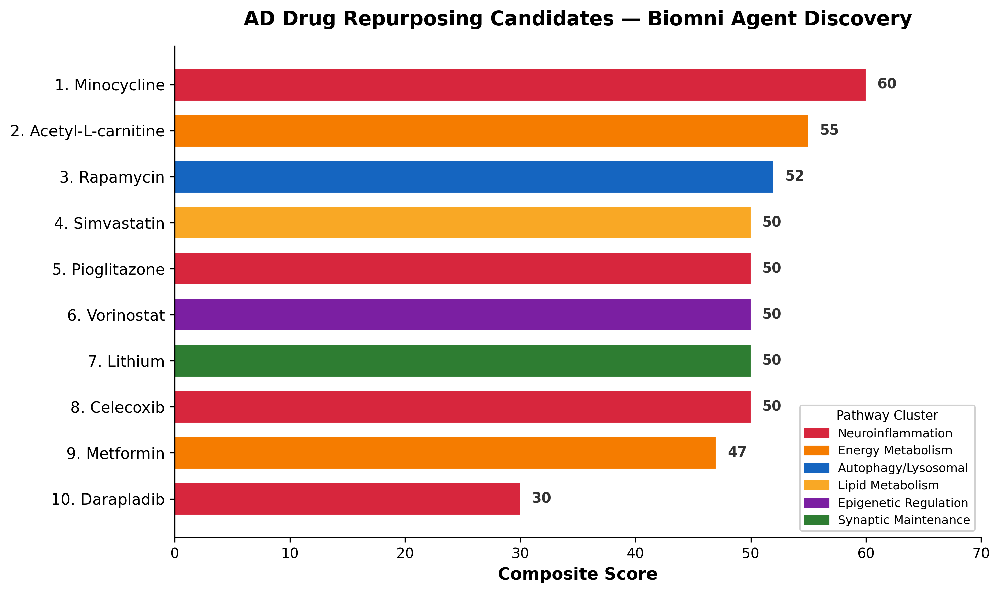
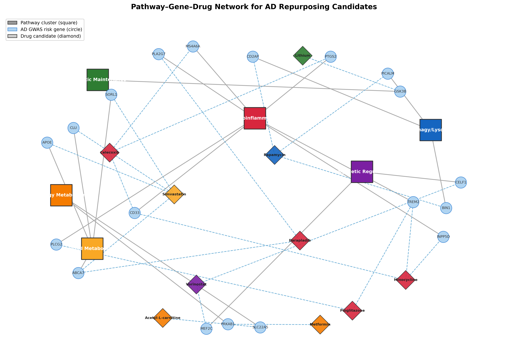
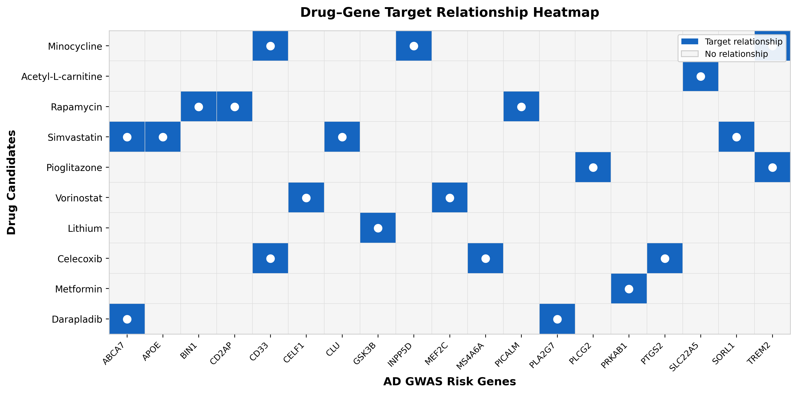

# AD Drug Repurposing via Biomni Agent

## Discovery

AI agent-driven identification of FDA-approved drugs with novel mechanistic rationale for Alzheimer's disease repurposing, targeting underexplored pathways including neuroinflammation, lipid metabolism, and autophagy.

## Method

- **Framework:** Biomni v0.0.8 (Stanford SNAP Lab)
- **LLM:** Claude Sonnet 4 (claude-sonnet-4-20250514) via Anthropic API
- **AD Workbench reference datasets:** TREAT-AD PAK1 Inhibitor 5xFAD Study, TREAT-AD BV2 BioHvY Study, WashU Knight ADRC proteomic data

## Methodology — Data Sources & Transparency

### Databases with verified API calls:
- **GWAS Catalog** — 3,258 AD-associated entries, 2,331 risk genes extracted from real data
- **OpenTargets** — GraphQL API queried for APOE, TREM2, CD33, BIN1, CLU, CD2AP, EPHA1, MS4A6A
- **ChEMBL** — drug mechanism and target queries for candidate compounds
- **TxGNN** — local graph neural network model predicted drug repurposing scores
  (Tacrine 0.9961, Acetylcarnitine 0.9953, Darapladib 0.9825)

### Agent-synthesized (LLM reasoning, not direct database extraction):
- Final top 10 drug ranking, composite scores, and BBB penetration ratings
- Pathway categorization of risk genes
- Experimental validation proposals
- Drug mechanism rationales

### Not queried (noted for transparency):
- STRING/BioGRID protein-protein interactions
- PubMed literature search (dependency failure)
- DrugBank (not available in Biomni; ChEMBL used instead)

This analysis represents an LLM-guided drug repurposing hypothesis generation
pipeline with selective database grounding. The GWAS risk gene landscape and
TxGNN predictions are computationally derived; downstream drug selection and
rationale synthesis leverage the LLM's biomedical training knowledge.

See [`results/methodology_audit.md`](results/methodology_audit.md) for the full audit.

## Reproduction

```bash
git clone https://github.com/MateenahJAHAN/biomni-ad-drug-repurposing.git
cd biomni-ad-drug-repurposing
# Install Biomni (see https://github.com/snap-stanford/Biomni for setup)
export ANTHROPIC_API_KEY="your-key"
python run_ad_repurposing.py
```

## Results

### Top 10 Ranked Drug Candidates

| Rank | Drug | Score | Target Pathway | Key GWAS Connections |
|------|------|-------|----------------|---------------------|
| 1 | **Minocycline** | 60 | Neuroinflammation | TREM2, CD33, INPP5D |
| 2 | **Acetyl-L-carnitine** | 55 | Energy Metabolism | Mitochondrial bioenergetics |
| 3 | **Rapamycin** | 52 | Autophagy/Lysosomal | BIN1, PICALM, CD2AP |
| 4 | **Simvastatin** | 50 | Lipid Metabolism | APOE, ABCA7, CLU |
| 5 | **Pioglitazone** | 50 | Neuroinflammation | TREM2, PLCG2 |
| 6 | **Vorinostat** | 50 | Epigenetic Regulation | MEF2C, CELF1 |
| 7 | **Lithium** | 50 | Synaptic Maintenance | GSK3β pathway |
| 8 | **Celecoxib** | 50 | Neuroinflammation | COX-2/inflammatory cascade |
| 9 | **Metformin** | 47 | Energy Metabolism | AMPK activation |
| 10 | **Darapladib** | 30 | Neuroinflammation | Lp-PLA2 inhibition |

### Pathway Convergence

- **Neuroinflammation** (TREM2, CD33, MS4A6A, PLCG2, INPP5D): Minocycline, Pioglitazone, Celecoxib
- **Autophagy/Lysosomal** (BIN1, PICALM, CD2AP): Rapamycin
- **Lipid Metabolism** (APOE, ABCA7, CLU, SORL1): Simvastatin
- **Mitochondrial Bioenergetics**: Acetyl-L-carnitine, Metformin
- **Epigenetic Regulation** (MEF2C, CELF1): Vorinostat

### Figures







### Data Files

| File | Description |
|------|-------------|
| [`ranked_drug_candidates.csv`](results/ranked_drug_candidates.csv) | Structured ranking with scores, targets, pathways, BBB penetration |
| [`validation_proposals.csv`](results/validation_proposals.csv) | Experimental protocols with AD Workbench dataset references |
| [`ad_repurposing_results.md`](results/ad_repurposing_results.md) | Full agent analysis with detailed rationale |
| [`ad_repurposing_full_trace.txt`](results/ad_repurposing_full_trace.txt) | Complete Biomni agent execution trace |

## Experimental Validation Proposals

### Primary Screening (Months 1-3)
- **Cell Lines:** iPSC-derived neurons, BV2 microglia, primary astrocytes
- **Dose-Response:** 3-5 concentrations spanning therapeutic range
- **Readouts:** Pathway-specific biomarkers, cell viability, neuroprotection

### Secondary Validation (Months 4-6)
- **Advanced Models:** 3D brain organoids, co-culture systems
- **Functional Assays:** Synaptic function, network activity, Aβ clearance

### Translational Studies (Months 7-12)
- **Animal Models:** 5xFAD, APP/PS1, APOE4 knock-in mice
- **Cognitive Testing:** Morris water maze, novel object recognition
- **Biomarkers:** CSF Aβ42, p-tau, neuroinflammatory markers

### AD Workbench Cross-References
- **TREAT-AD PAK1 Inhibitor 5xFAD Study:** Validates kinase inhibition approach; supports neuroinflammation pathway candidates (Minocycline, Pioglitazone)
- **TREAT-AD BV2 BioHvY Study:** Microglial transcriptomic data to validate predicted TREM2/CD33 pathway drug effects
- **WashU Knight ADRC (3,150 patients):** Proteomic data to verify altered protein levels of drug targets in AD patients

## Combination Therapy Potential
- Minocycline + Rapamycin (neuroinflammation + autophagy)
- Simvastatin + Acetyl-L-carnitine (lipid metabolism + mitochondrial function)
